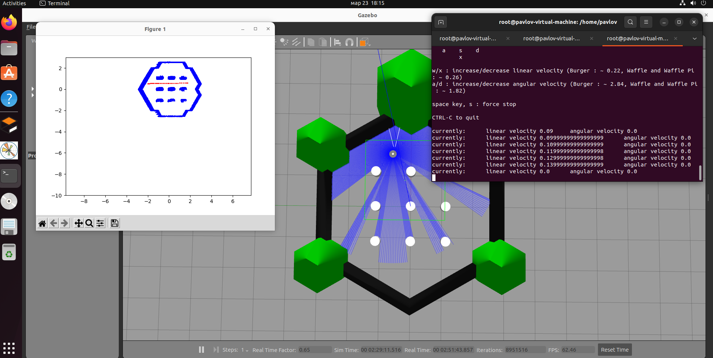
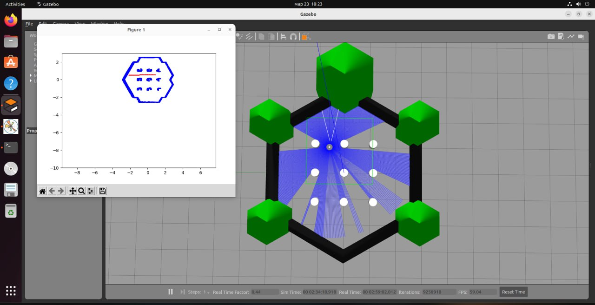

# ROS_2_node_map_plotting

# Package overview
 
  Реализована структура, состоящая из 2 нод: паблишера и сабскрайбера. В качестве паблишера используется встроенный в ROS2 пакет turtlebot3, который позволяет создать 2 топика с данными одометрии и лидара. В качестве второй ноды (сабскрайбера) использована самостоятельно написанная программа, которая преобразует полученные данные в массив точкек на карте, попутно сохраняя каждую из них в массив, параллельно визуальзируя полученные и обработанные данные.

